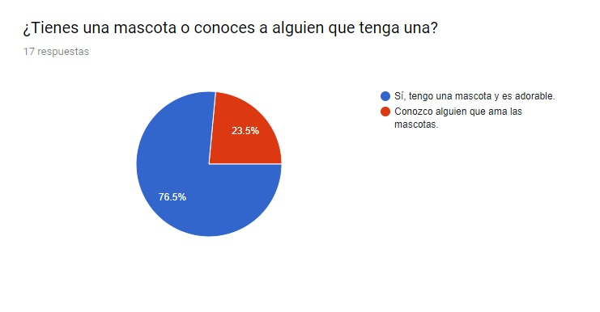
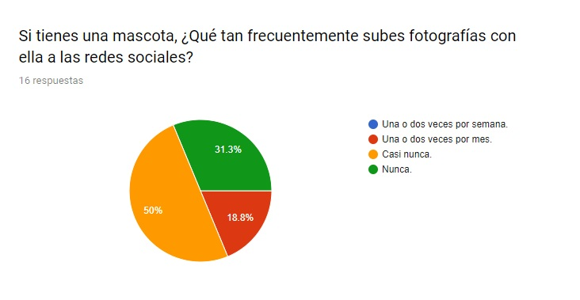
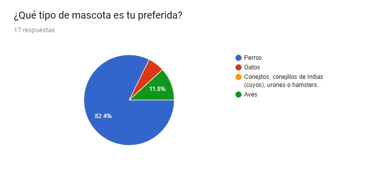
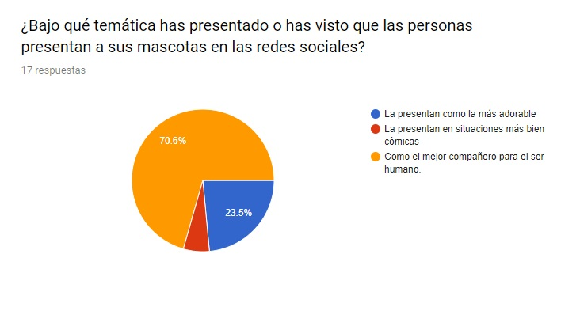
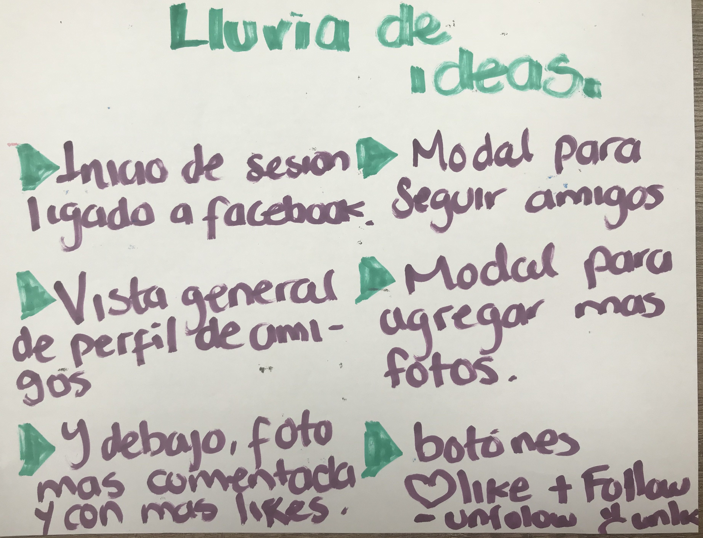
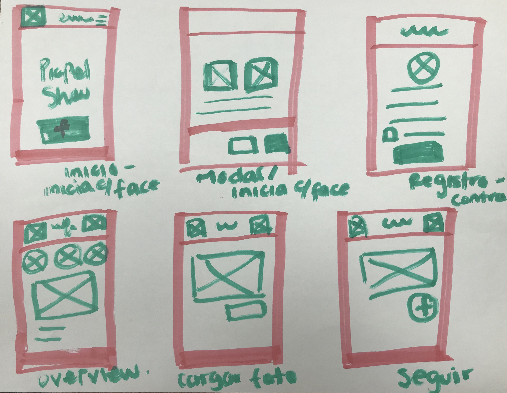
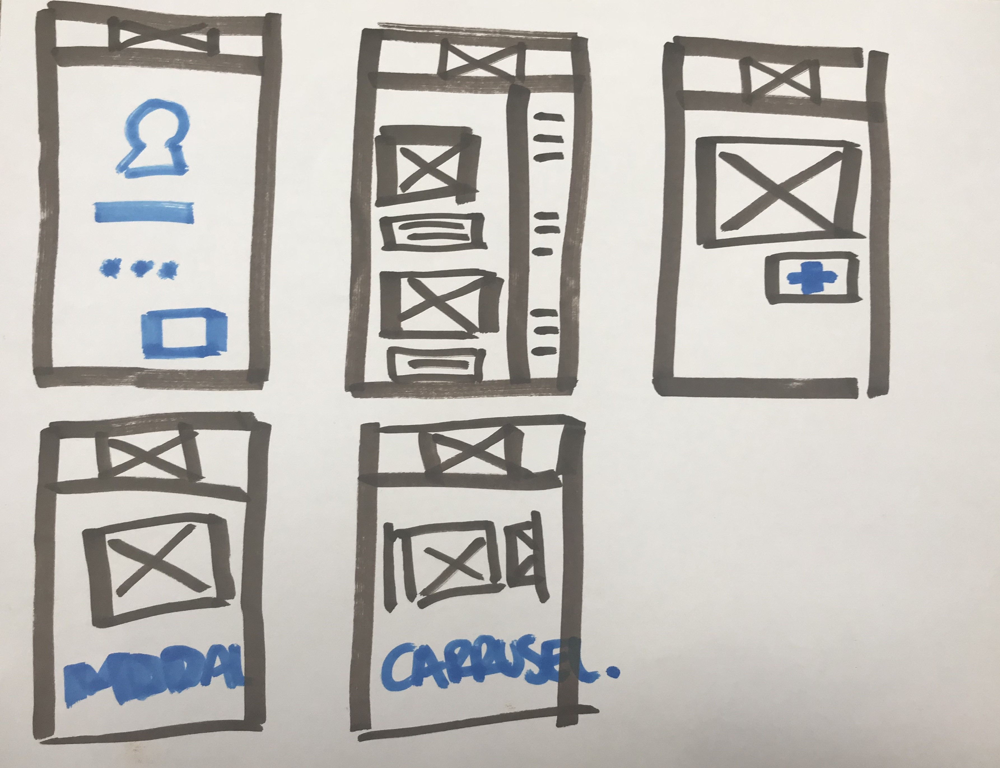

## INTRODUCCION
El cliente tiene como función principal en su A.C. identificar mascotas sin hogar o maltratadas, encontrarles atención médica inmediata, darles acogida en una familia y una vez logrado llevar el monitoreo de vigilancia para asegurarse de que las mascotas están integradas en una familia amorosa y responsable. Adicional a esto, también crea “pasarelas digitales” en las que, por medio de fotos o videos, las mascotas son vistas en su mejor presentación, siendo protagonistas de un meme o realizando actividades singulares, esto sólo con fines recreativos.
Para cumplir tales propósitos, actualmente el cliente se ve en la necesidad de generar y consultar estos múltiples contenidos a través  de las redes sociales ya existentes, tales como Facebook, Twitter e Instagram lo que les hace perder tiempo localizando adoptantes y atención médica navegando entre los diversos contenidos que en éstas redes se generan. Esto trae cómo resultado la pérdida de vidas de mascotas, estrés y frustración, lo que crea la necesidad de la implementación de una herramienta donde puedan realizar sus actividades de manera eficiente.

## INVESTIGACIÓN Y EMPATÍA

### Metodología
La metodología para alcanzar los objetivos del producto se divide en el uso de los siguientes métodos específicos:

* **Entrevistas/encuestas a clientes** Se realizaran Entrevistas personales y encuenstas a los usuarios en general para identificar de manera más efectiva las áreas de oportunidad de las redes sociales actuales en los que se apoyan, guardando y consultando información de las mascotas.
* **Resultado de entrevistas** 

* **Mención de descubrimientos** 

## DEFINICIÓN

### Hipótesis sobre información obtenida
### Definición del problema principal
Los activistas no cuentan con una herramienta que concentre toda la información de las mascotas y de los que apoyan,  que sea de fácil acceso para su localización, solución, seguimiento e interactividad.

### Objetivos
El objetivo principal de este producto es crear una herramienta web para visualizar los siguientes datos de forma rápida y sencilla:
1. Identificar mascotas sin hogar o maltratadas.
2. Encontrarles atención médica inmediata.
3. Darles acogida en una familia.
4. Llevar a cabo el monitoreo de vigilancia.
5. Crear las “pasarelas digitales”. 

### Muestra de pruebas y resultados de lluvia de ideas para definir el problema
Proceso de brainstorming:

Lluvia de ideas:

## IDEACIÓN
### Muestra de pruebas y resultados de lluvia de ideas para definir la solución

Primer prototipo:

Segundo prototipo:

## SKETCHING & PROTOTYPING  

### Persona ###

### Historia del usuario

### Sketch de flujo de aplicación

[Link a sketch/prototipo final](https://marvelapp.com/57bc2hj) 

Preview Sketch:

